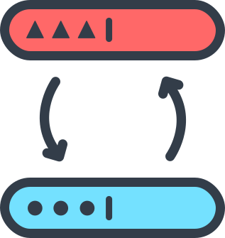

<br />

<p align="center">

</p>

<br />

[](https://codecov.io/gh/ngze/control-value-adapter)
[]()
[]()
[]()
[](https://github.com/prettier/prettier)
[](#contributors-)

> A seamless way to transform ControlValueAccessor values in two-ways.  

## Features

## Installation

```
# Using ng
ng add @ngze/control-value-adapter

# Using yarn
yarn add @ngze/control-value-adapter

# Using npm
npm i @ngze/control-value-adapter
```

### Usage

## Contributors ✨

Thanks goes to these wonderful people ([emoji key](https://allcontributors.org/docs/en/emoji-key)):

<!-- ALL-CONTRIBUTORS-LIST:START - Do not remove or modify this section -->
<!-- prettier-ignore-start -->
<!-- markdownlint-disable -->
<table>
  <tr>
    <td align="center"><a href="https://il.linkedin.com/in/zeev-katz"><br /><sub><b>Zeev Katz</b></sub></a><br /><a href="https://github.com/@ngze/control-value-adapter/commits?author=ZeevKatz" title="Code"> 💻 </a> <a href="https://github.com/@ngze/control-value-adapter/commits?author=ZeevKatz" title="Documentation"> 📖 </a> <a href="#ideas-ZeevKatz" title="Ideas, Planning, & Feedback"> 🤔 </a> <a href="#maintenance-ZeevKatz" title="Maintenance"> 🚧 </a></td>
  </tr>
</table>

<!-- markdownlint-restore -->
<!-- prettier-ignore-end -->
<!-- ALL-CONTRIBUTORS-LIST:END -->

This project follows the [all-contributors](https://github.com/all-contributors/all-contributors) specification. Contributions of any kind welcome!
